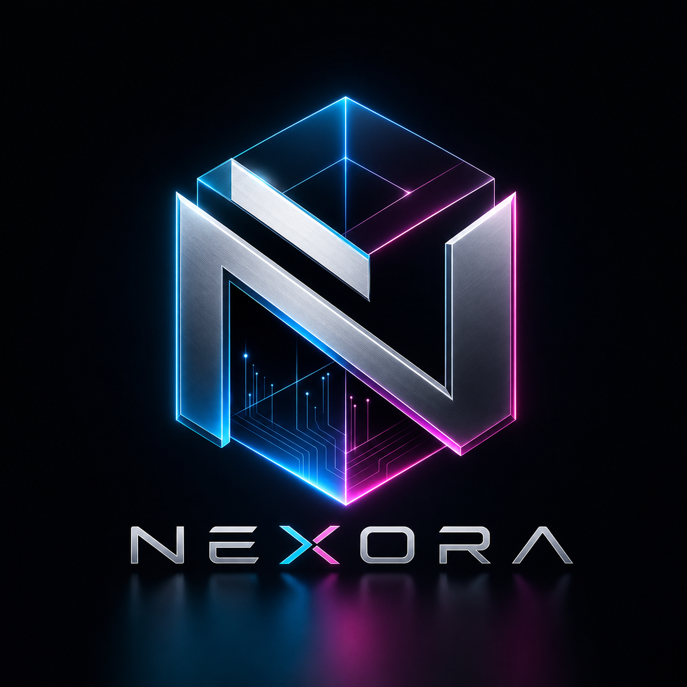
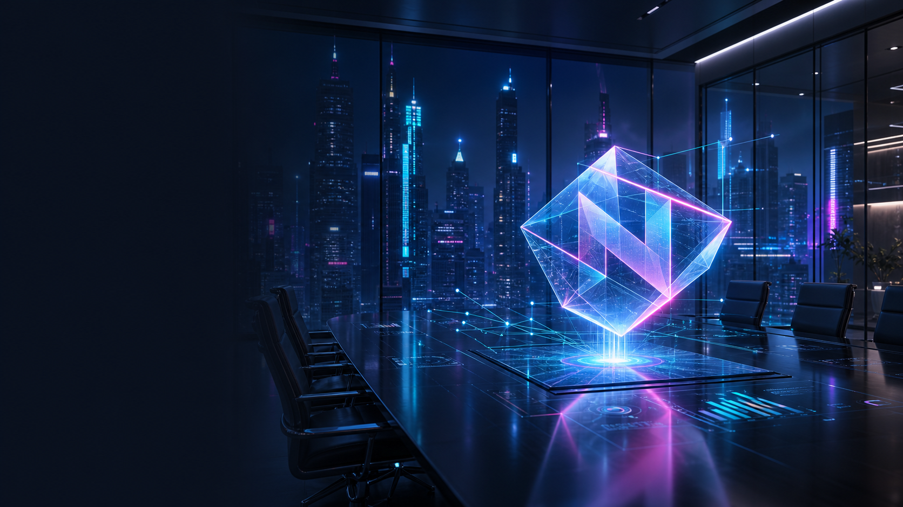
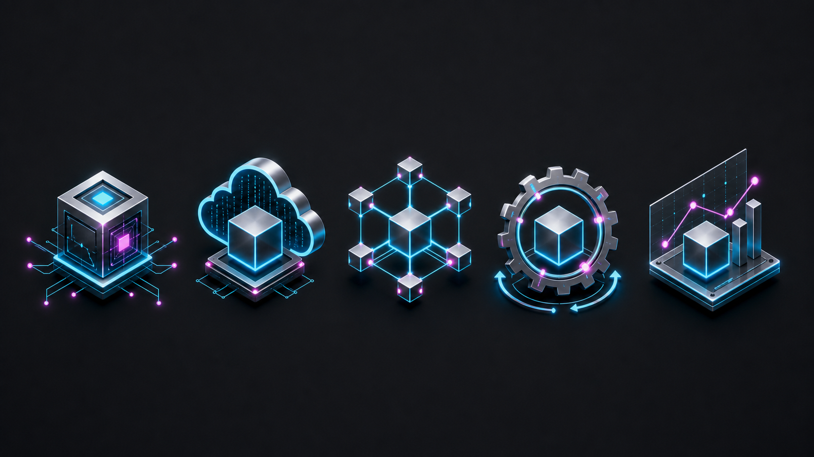
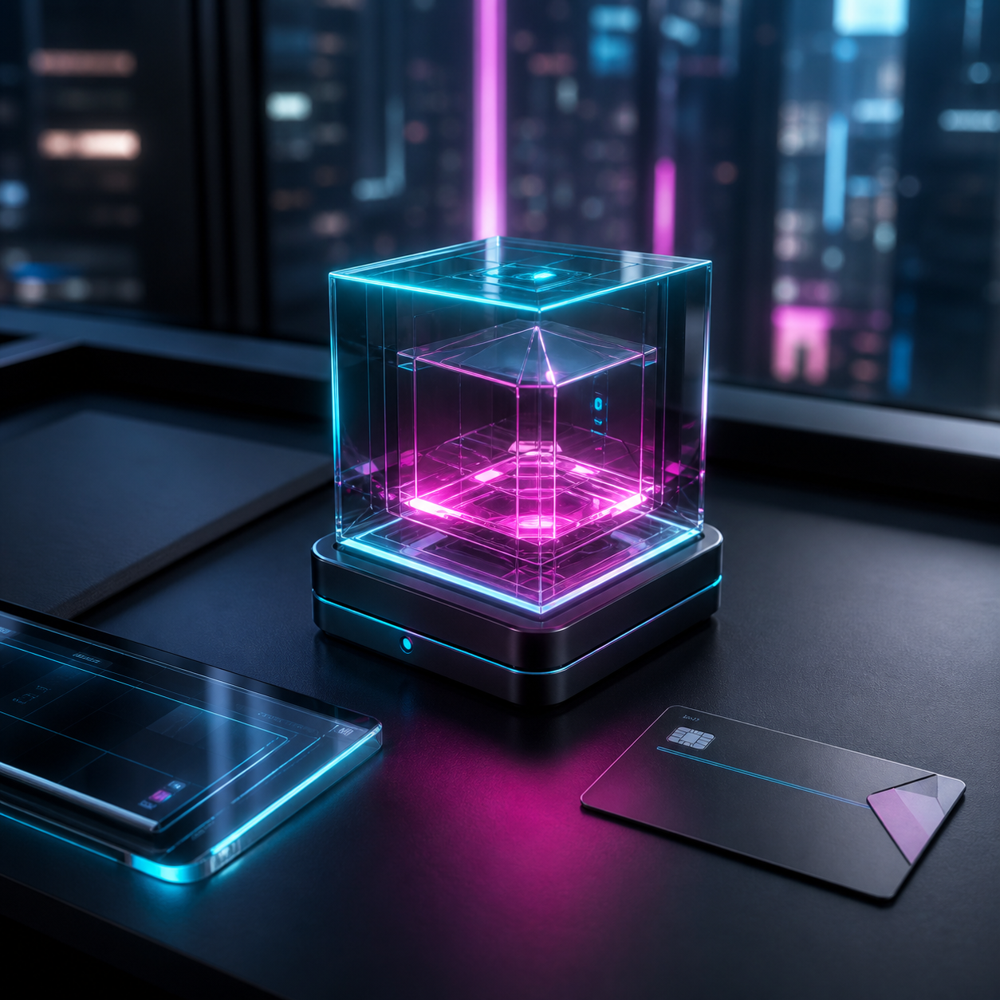
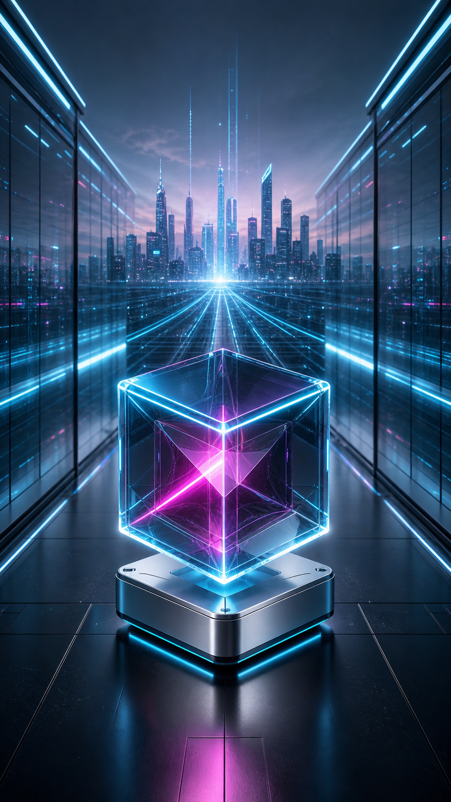

# Creative Visionary: Cyberpunk-Corporate Visual Assets

## Overview

This project is an AI image generation task for a fictional tech startup rebrand named **NEXORA**. The goal is to create high-quality, brand-consistent visual assets with a unique **Cyberpunk-Corporate** aesthetic.

## Brand System

- Brand name: NEXORA
- Aesthetic: Cyberpunk-Corporate
- Core motif: transparent glowing prism/cube with angular N-inspired geometry
- Colors: graphite black, electric cyan, magenta accents, brushed silver, clear glass
- Lighting: cyan rim light, magenta internal glow, low-key studio lighting, polished reflections

## Deliverables

| File | Purpose |
| --- | --- |
| `assets/01-nexora-logo-concept.png` | Logo concept |
| `assets/02-nexora-hero-image.png` | Website hero image |
| `assets/03-nexora-icon-set.png` | Icon set |
| `assets/04-nexora-ai-core-social.png` | Square social media visual |
| `assets/05-nexora-data-corridor-story.png` | Vertical story/campaign visual |
| `CREATIVE_VISIONARY_ASSET_PROMPTS.md` | Full prompt documentation |

## Asset Preview

### Logo Concept

### Website Hero Image

### Icon Set

### Social AI Core Visual

### Vertical Story Visual

## Tools Used

- AI image generation model
- Advanced prompting
- Negative prompts
- Aspect-ratio-specific prompt design
- Image-to-image consistency approach through repeated visual anchors

## Consistency Method

The same visual identity anchors were repeated across all prompts:

- glowing prism/cube object
- cyan neon edges
- magenta inner light
- graphite and silver corporate materials
- polished futuristic lighting
- clean enterprise technology setting

This keeps the generated assets visually connected across logo, website, icon, and social media use cases.
